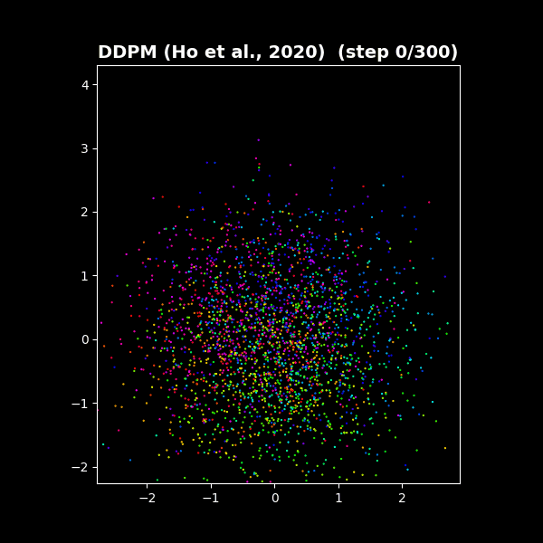
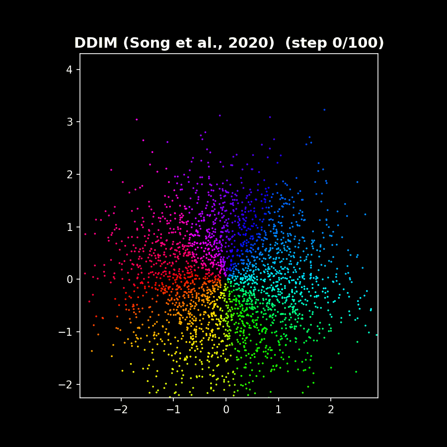
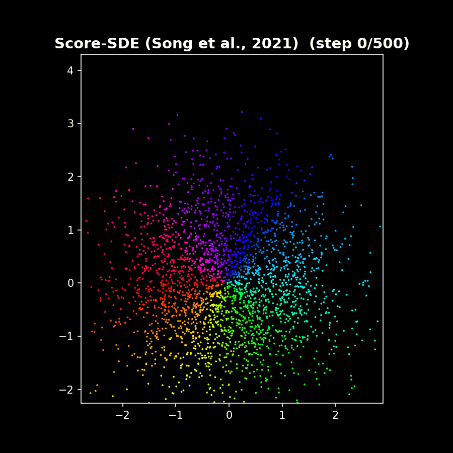
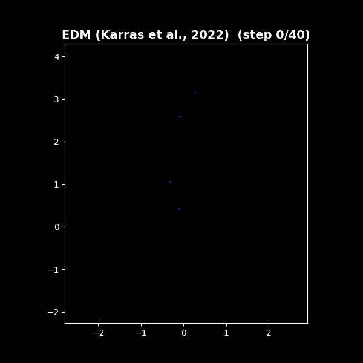
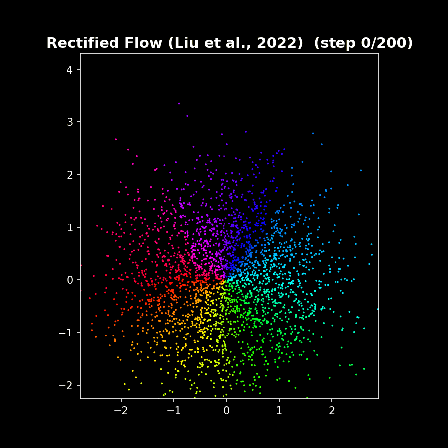
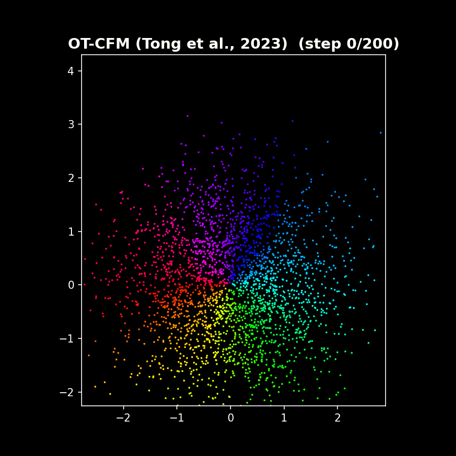

# ToyDiffusion

A minimal diffusion model you can run on your laptop. The code implements the core ideas from the [DDPM paper](https://arxiv.org/abs/2006.11239) (Ho et al., 2020) on a toy 2D dataset (Homer Simpson pixel coordinates), so you can see the full forward/reverse diffusion pipeline without needing a GPU or a U-Net.

[Medium post](https://thiago-lira.medium.com/a-toy-diffusion-model-you-can-run-on-your-laptop-20e9e5a83462)

## DiffusionGenealogy: 6 Generative Frameworks Compared

A showcase of 6 generative frameworks — all trained on the same Homer Simpson scatterplot, each producing colored-trajectory GIFs. Every (x,y) point is an independent 2D sample with a shared point-wise MLP.

| DDPM | DDIM | Score-SDE |
|:---:|:---:|:---:|
|  |  |  |
| Stochastic reverse, 300 steps | Deterministic, 50 steps | VP-SDE PF-ODE, 500 steps |

| EDM | Rectified Flow | OT-CFM |
|:---:|:---:|:---:|
|  |  |  |
| Heun 2nd-order, 40 steps | Euler ODE, 100 steps | OT-coupled Euler, 50 steps |

### Running

```bash
# Install dependencies
uv sync

# Run all 6 variants (default 100 epochs)
python main.py

# Run specific variants
python main.py ddpm rectified_flow

# Override training epochs
python main.py --epochs 200

# List available variants
python main.py --list
```

### Variants

| Framework | Paper | Training Target | Sampling | Steps |
|:---|:---|:---|:---|---:|
| **DDPM** | Ho et al., 2020 | Epsilon (noise) prediction | Stochastic reverse walk | 300 |
| **DDIM** | Song et al., 2020 | Epsilon prediction (shared w/ DDPM) | Deterministic (eta=0) | 50 |
| **Score-SDE** | Song et al., 2021 | Score function matching | PF-ODE (Euler) | 500 |
| **EDM** | Karras et al., 2022 | Preconditioned denoiser (x_0 pred) | Heun 2nd-order | 40 |
| **Rectified Flow** | Liu et al., 2022 | Velocity field | Euler ODE | 100 |
| **OT-CFM** | Tong et al., 2023 | Velocity field (OT-coupled) | Euler ODE | 50 |

### Architecture

All variants share a point-wise `TimeConditionedMLP`: each (x,y) point is an independent 2D sample. The network takes `(x,y,t) → 2D output` via sinusoidal time embedding + 4-layer MLP with SiLU activations (hidden_dim=256).

### Project Structure

```
DiffusionGenealogy/
├── shared/          # TimeConditionedMLP, data loading, GIF visualization
├── ddpm/            # Epsilon-prediction, stochastic reverse
├── ddim/            # Same training, deterministic sampling
├── score_sde/       # VP-SDE score matching, PF-ODE
├── edm/             # Preconditioned denoiser, Heun solver
├── rectified_flow/  # Linear interpolation, velocity prediction
└── ot_cfm/          # Rectified flow + minibatch OT coupling
```

## Original Notebook

Run all cells in the `RunDiffusion.ipynb` notebook for the original whole-vector DDPM implementation with inline explanations tied to the paper.


